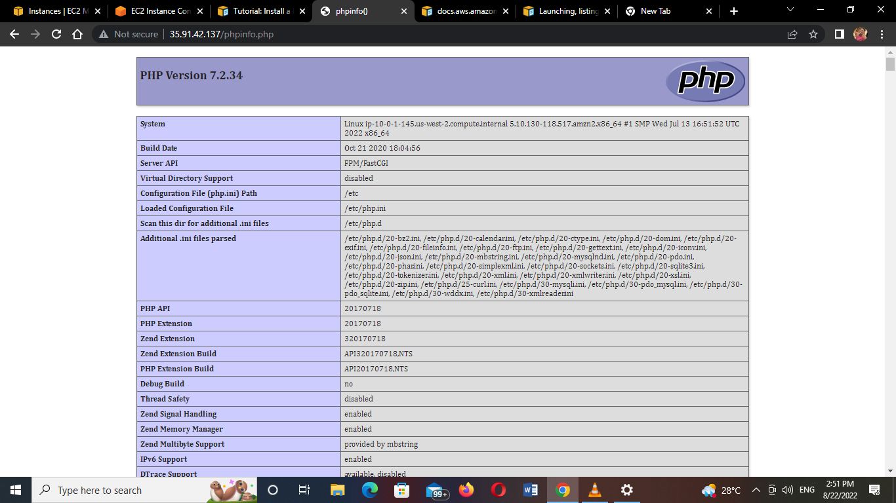
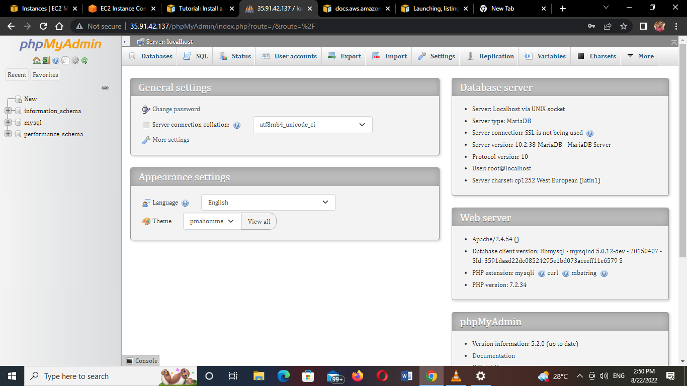
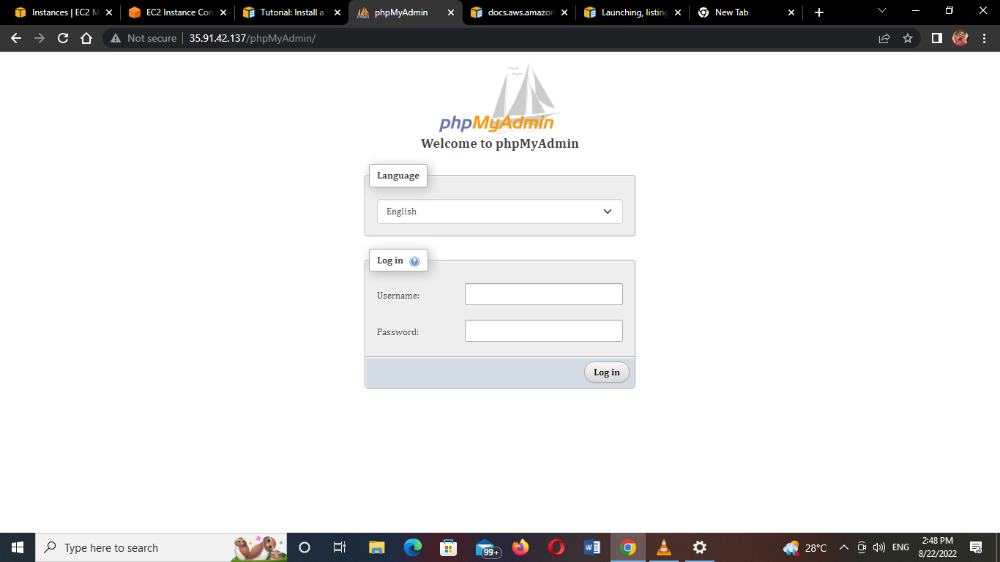
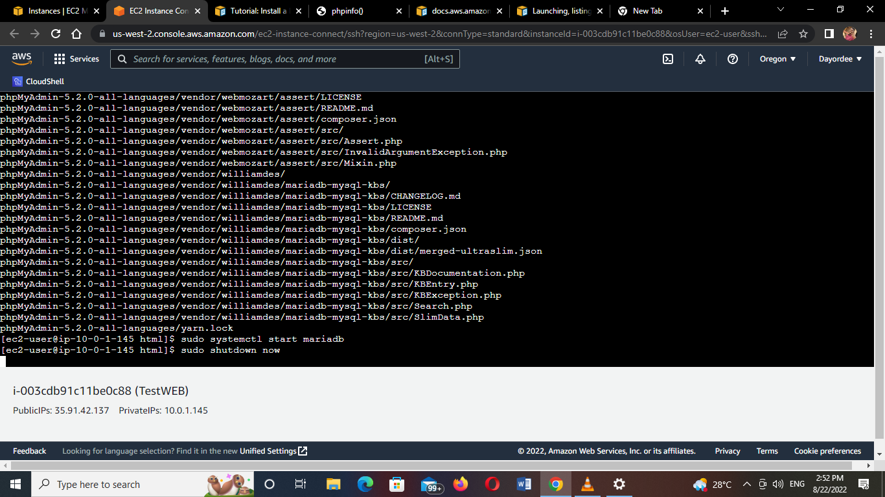

## Install a LAMP web server on Amazon Linux

Tasks:

1. Prepare the LAMP server
2. Test your LAMP server
3. Secure the database server
4. Install phpMyAdmin

Guide: https://docs.aws.amazon.com/AWSEC2/latest/UserGuide/install-LAMP.html

Grading tip:  Screenshot major script outputs and upload with your step by step answer

